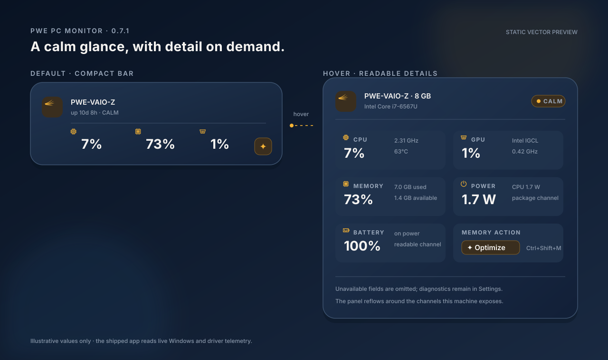

<div align="center">

# PWE PC MONITOR

**A calm Windows hardware monitor from Paradise Production.**

Current public build: **0.7.1**

</div>

PWE PC MONITOR is the Windows companion to PWE MAC MONITOR. It keeps the wing mark, navy/amber palette, typography, calm/warm/hot status language, compact dashboard and 1–5 second sampling rhythm while using Windows-native telemetry and LibreHardwareMonitor.

## Current features

- Windows notification-area icon with CPU activity rule and health colour.
- Left-click dashboard; right-click settings and quit menu. The tray dashboard dismisses itself when focus moves to the desktop or another window.
- Optional always-on-top floating widget that dynamically adds readable CPU, GPU, memory, power, battery and fan metrics while hiding unsupported fields.
- CPU usage, frequency, temperature, package power and per-core bars when available.
- GPU usage, frequency, temperature and power when available.
- Vendor-aware GPU temperature sources: NVIDIA NVAPI, AMD ADL and Intel IGCL through the installed graphics driver, with the selected provider retained in sensor diagnostics.
- Memory, system drive capacity, network throughput/address, battery and top processes.
- Explicit **Optimize memory** action trims eligible large user-process working sets without terminating processes; the result reports the estimated working-set delta and may not permanently increase free RAM.
- Read-only fan RPM display. **There is no fan-control or hardware-write path.**
- 89-sample CPU, GPU and power history.
- System, dark and light themes using the PWE brand palette.
- 1, 2, 3 or 5 second refresh intervals.
- Optional full sensor list.
- Launch-at-login setting stored for the current Windows user.
- Graceful fallback to basic Windows metrics if enhanced hardware sensors are unavailable.
- Motherboard temperature and fan channels are attempted even when PawnIO is not installed; unsupported or protected channels are recorded in Sensor diagnostics instead of being treated as zero.
- CPU/GPU temperature diagnostics distinguish missing PawnIO, missing elevation and channels that the hardware/driver does not expose.
- GPU temperature selection prefers the vendor's core/edge channel instead of accidentally showing a memory-junction or hotspot value as the main GPU temperature. Hotspot and memory channels remain available in the full sensor list.
- Explicit **Get PawnIO** and **Recheck sensors** actions are available from the dashboard, Settings menu and tray menu.
- PawnIO is optional: without it, the app stays in native sensor mode and does not probe protected motherboard controller registers.
- Empty or unsupported values are hidden from the dashboard and floating widget. Their sensor diagnostics remain available from Settings and the tray menu.

## Interface preview

The always-on widget stays compact for a quick glance: vector glyphs carry the CPU, memory and GPU/power/battery values without repeating labels. Rest the pointer on it to open a calm detail panel where each readable channel, including SSD capacity, returns with its icon and full text label. The panel reflows around readable channels, while unsupported fields stay out of the way and remain available in Settings diagnostics.



<sub>Static vector preview for README documentation; the values shown are illustrative, not a captured live reading.</sub>

## Requirements

- Windows 10 version 2004 or later, or Windows 11.
- x64 PC for the first packaged build.
- Some motherboard, CPU-temperature and fan sensors require LibreHardwareMonitor's PawnIO hardware-access layer and may not be exposed by every PC or laptop.

Missing or unsupported measurements are hidden from the dashboard and floating widget; the app does not invent or estimate unavailable sensor values. Open **Settings → Sensor diagnostics** to see the channels that the current hardware or driver did not expose.

## Download a public Windows build

Use the repository's [Releases](https://github.com/kenshinice-ai/pwepcmonitor/releases) page. Each release includes:

- `pwe-pc-monitor-win-x64-<version>.zip`, a self-contained Windows x64 build;
- `pwe-pc-monitor-win-x64-<version>.sha256`, the SHA-256 checksum.

The `Actions` artifact is kept as a short-lived CI diagnostic (30 days). Releases are the stable public download path.

## Run a packaged build

1. Download the versioned zip from the public Releases page.
2. Extract the archive to a normal user-writable folder.
3. Run `PwePcMonitor.exe`.
4. Look for the PWE wing in the Windows notification area. Windows may place a new icon in the overflow menu until it is pinned.

The published artifact is self-contained and does not require a separate .NET installation.

If Windows SmartScreen shows an unknown-publisher warning, choose **More info** and verify that the file came from the PWE PC MONITOR GitHub Release. The first public builds are not Authenticode-signed yet.

If a machine has a hardware-specific sensor problem, start `PwePcMonitor.exe --safe-mode` once. Safe mode keeps the dashboard and Windows-native CPU, memory, disk, network, battery and process readings while skipping enhanced sensor-driver access. The app writes startup and sampling diagnostics to `%LOCALAPPDATA%\PWE\PC Monitor\logs\latest.log`.

Motherboard temperature chips and CPU/GPU temperature channels may require the official [PawnIO Setup](https://github.com/namazso/PawnIO.Setup/releases) support used by LibreHardwareMonitor or an elevated process. Administrator mode and PawnIO are separate prerequisites. When PawnIO is missing, choose **Get PawnIO** in the dashboard, Settings menu or tray menu; the app opens the official installer download in your browser. After completing the UAC install, choose **Recheck sensors** so the current monitor session reopens its hardware connection. PWE does not bundle, download silently or execute a kernel driver installer. Some laptops and proprietary controllers do not expose readable or controllable channels at all.

Without PawnIO, the monitor still keeps Windows-native CPU usage, memory, disk, network, battery and process data, and LibreHardwareMonitor can expose any CPU/GPU/storage channels that the installed hardware and driver make available. Board EC/SMBus channels and most fan RPM channels remain unavailable by design. Windows' generic WMI temperature-probe class is not used as a CPU/GPU substitute because Microsoft documents that its `CurrentReading` is not populated by current implementations.

### GPU provider matrix

PWE does not bundle vendor driver DLLs or load an untrusted replacement. The packaged app asks LibreHardwareMonitor to use the vendor backend already installed with Windows graphics drivers and falls back to its generic GPU sensor channel when a vendor API is unavailable.

| GPU family | Driver backend | Runtime boundary |
| --- | --- | --- |
| NVIDIA GeForce / RTX / Quadro | [NVAPI thermal API](https://docs.nvidia.com/nvapi/group__gputhermal.html) | NVIDIA's `nvapi64.dll` supplied by the display driver |
| AMD Radeon | [AMD ADL/ADL2](https://gpuopen.com/archived/adl/) backend (ADLX is the newer SDK) | AMD's `atiadlxx.dll` supplied by the display driver |
| Intel UHD / Iris / Arc | [Intel Graphics Control Library (IGCL)](https://intel.github.io/drivers.gpu.control-library/Control/api.html) | Intel's `ControlLib.dll` supplied by the graphics driver |

The UI reports the selected source as `NVIDIA NVAPI via LibreHardwareMonitor`, `AMD ADL via LibreHardwareMonitor` or `Intel IGCL via LibreHardwareMonitor` in Sensor diagnostics. If the driver does not expose a readable temperature, the temperature field is hidden and the reason remains available in Settings; no estimate is shown. These GPU driver telemetry paths do not require PawnIO. PawnIO remains an optional path for protected motherboard/controller channels.

## Build from source

Install the .NET 10 SDK, then run:

```powershell
dotnet restore PwePcMonitor.slnx
dotnet build PwePcMonitor.slnx --configuration Release
./scripts/build-windows.ps1 -Runtime win-x64 -PackageVersion dev
```

The publish output is written to `artifacts/win-x64`; the zip and checksum are written to `artifacts/`.

## Architecture

```text
src/Pwe.PcMonitor/
  Models/                 snapshots, readings and health rules
  Services/
    WindowsMetricsReader  basic CPU, memory, disk, network, battery and process data
    SystemSampler         read-only LibreHardwareMonitor adapter, vendor-aware GPU temperature selection and graceful fallback
    MemoryOptimizer        opt-in user-session working-set trim; no process termination or standby-list purge
    GpuTemperatureProvider maps NVIDIA NVAPI, AMD ADL and Intel IGCL-backed GPU sensors
    SensorAccessService    explicit official PawnIO link, elevation and recheck flow
    ThemeManager          brand palette and system theme selection
    StartupService        current-user launch-at-login entry
  ViewModels/             sampling loop, history and formatted UI state
  Controls/               lightweight sparkline renderer
  App.*                   tray lifecycle and dynamic icon
  MainWindow.*            dashboard and settings surface
```

The application runs as the signed-in user (`asInvoker`). It does not contain a privileged helper, does not write fan controls, and does not transmit telemetry.

## Health colours

- **Calm:** normal text colour. No attention colour is spent on a normal reading.
- **Warm:** PWE amber.
- **Hot:** coral, reserved for a genuine warning.

CPU/GPU temperature defaults are warm at 75 °C and hot at 92 °C. Storage temperature defaults are warm at 55 °C and hot at 68 °C. These are presentation thresholds only; they do not change hardware behaviour.

## Verification boundary

The solution can be compiled from macOS with Windows targeting enabled. The GitHub Actions workflow performs the authoritative Windows build and launches the published EXE in a five-second safe-mode smoke test. The notification-area UI, Windows APIs, enhanced sensor access, sleep/resume behaviour and hardware compatibility still need verification on real Windows PCs.

## Licences and brand

Source code is MIT licensed. LibreHardwareMonitor is MPL-2.0. Bundled fonts use the SIL Open Font License 1.1. See [THIRD-PARTY-NOTICES.md](THIRD-PARTY-NOTICES.md).

PWE names, the Paradise wing mark and related brand assets are not granted under the MIT source-code licence. See [LICENSE](LICENSE).
